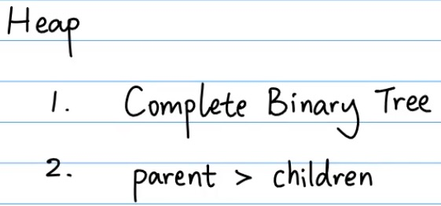
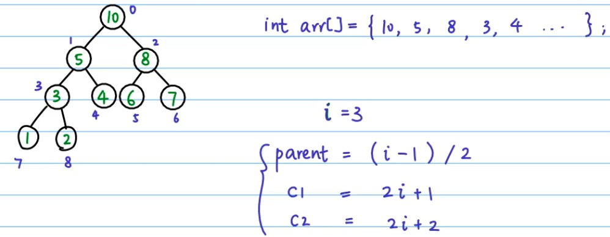
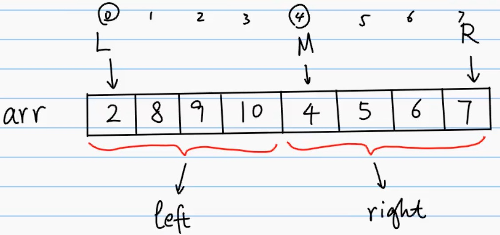

## **排序算法**


## 算法复杂度

| 排序                 | 时间复杂度 | 空间复杂度 | 稳定性 |
| :------------------- | :--------: | :--------: | :----: |
| 1.冒泡排序           |   O(n^2)   |    O(1)    |  稳定  |
| 2.快速排序           |  O(nlogn)  |  O(nlogn)  | 不稳定 |
| 3.插入排序(简单插入) |   O(n^2)   |    O(1)    |  稳定  |
| 4.希尔排序           |   O(n^2)   |    O(1)    | 不稳定 |
| 5.选择排序(简单选择) |   O(n^2)   |    O(1)    | 不稳定 |
| 6.堆排序             |  O(nlogn)  |    O(1)    | 不稳定 |
| 7.二路归并排序       |  O(nlogn)  |    O(n)    |  稳定  |
| 8.计数排序           |   O(n+k)   |   O(n+k)   |  稳定  |
| 9.桶排序             |   O(n^2)   |   O(n+k)   |  稳定  |
| 10.基数排序          |   O(n*k)   |   O(n+k)   |  稳定  |


## 1.冒泡排序(Bubble Sort) 稳定


##### 每次对比相邻的两个数

冒泡排序是一种简单的排序算法。它重复地走访过要排序的数列，一次比较两个元素，如果它们的顺序错误就把它们交换过来。走访数列的工作是重复地进行直到没有再需要交换，也就是说该数列已经排序完成。这个算法的名字由来是因为越小的元素会经由交换慢慢“浮”到数列的顶端。

- 比较相邻的元素。如果第一个比第二个大，就交换它们两个；
- 对每一对相邻元素作同样的工作，从开始第一对到结尾的最后一对，这样在最后的元素应该会是最大的数；
- 针对所有的元素重复以上的步骤，除了最后一个；
- 重复步骤1~3，直到排序完成。

```java
public void bubbleSort(int[] arr){
  boolean  keep = true; //防止已经排好顺序还继续traverse
  for(int i = 0; i < arr.length - 1 && keep; i++){
    keep = false;
    for(int j = 0; j < arr.length - i - 1; j++){
      if(arr[j] > arr[j+1]){
        int temp = arr[j];
        arr[j] = arr[j+1];
        arr[j+1] = temp;
        keep = true;
      }
    }
  }
}
```

## 2.快速排序(Quick Sort) 不稳定


##### 右边找小的，左边找大的

快速排序的基本思想：通过一趟排序将待排记录分隔成独立的两部分，其中一部分记录的关键字均比另一部分的关键字小，则可分别对这两部分记录继续进行排序，以达到整个序列有序。

- 从数列中挑出一个元素，称为 “基准”（pivot）；
- 重新排序数列，所有元素比基准值小的摆放在基准前面，所有元素比基准值大的摆在基准的后面（相同的数可以到任一边）。在这个分区退出之后，该基准就处于数列的中间位置。这个称为分区（partition）操作；
- 递归地（recursive）把小于基准值元素的子数列和大于基准值元素的子数列排序。

```java
public void quickSort(int[] arr){
  helper(arr, 0, arr.length - 1);
}
public void helper(int[] arr, int left, int right){
  if(left >= right){
    return;
  }
  int l = left;
  int r = right;
  int pivot = arr[left];
  while(l < r){
    while(l < r && arr[r] >= pivot){ //在右边找比pivot小的
      r--;
    }
    if(l < r){  //确保不是因为l<r而退出上面的while循环
      arr[l] = arr[r]; //把第一个比pivot小的换到原来pivot的位置上
      //这里一定是l不是left
    }
    while(l < r && arr[l] <= pivot){ //在左边找比pivot大的
      l++;
    }
    if(l < r){  //确保不是因为l<r而退出上面的while循环
			arr[r] = arr[l]; //把第一个比pivot大的换到原来的r位置上
    }
  }
  arr[l] = pivot; //把pivot的值换到l的位置上(原来第一个比pivot大的)
  helper(arr, left, l - 1);
  helper(arr, l + 1, right);
}
```

## 3.插入排序(Insertion Sort) 稳定


##### 每次找前面大的数

插入排序（Insertion-Sort）的算法描述是一种简单直观的排序算法。它的工作原理是通过构建有序序列，对于未排序数据，在已排序序列中从后向前扫描，找到相应位置并插入。

- 从第一个元素开始，该元素可以认为已经被排序；
- 取出下一个元素，在已经排序的元素序列中从后向前扫描；
- 如果该元素（已排序）大于新元素，将该元素移到下一位置；
- 重复步骤3，直到找到已排序的元素小于或者等于新元素的位置；
- 将新元素插入到该位置后；
- 重复步骤2~5。

```java
public void insertionSort(int[] arr){
  for(int i = 0; i < arr.length; i++){
    for(int j = i; j > 0; j--){
      if(arr[j] < arr[j-1]){
        int temp = arr[j];
        arr[j] = arr[j-1];
        arr[j-1] = temp;
        //最普通的方法，每次都要交换两个元素，相当于多一次
      }
    }
  }
}
```

Optimized:

```java
public void insertionSort(int[] arr){
  for(int i = 0; i < arr.length; i++){
    int currVal = arr[i];
    int prev = i - 1;
    while(prev >= 0 && currVal < arr[prev]){
      arr[prev+1] = arr[prev--];
    }
    arr[prev+1] = currVal;
    //相当于只在最后给pre + 1赋值currVal
  }
}
```

## 4.希尔排序(Shell Sort) 不稳定


##### 隔一个gap的插入排序

1959年Shell发明，第一个突破O(n2)的排序算法，是简单插入排序的改进版。它与插入排序的不同之处在于，它会优先比较距离较远的元素。希尔排序又叫**缩小增量排序**。

- 选择一个增量序列t1，t2，…，tk，其中ti>tj，tk=1；
- 按增量序列个数k，对序列进行k 趟排序；
- 每趟排序，根据对应的增量ti，将待排序列分割成若干长度为m 的子序列，分别对各子表进行直接插入排序。仅增量因子为1 时，整个序列作为一个表来处理，表长度即为整个序列的长度。

```java
public void shellSort(int[] arr){
  //这里取增量为length/2，缩小增量为gap=gap/2
  for(int gap = arr.length / 2; gap > 0; gap /= 2){
    for(int i = gap; i < arr.length; i++){
      int currVal = arr[i];
      int prev = i - gap;
      while(prev >= 0 && currVal < arr[prev]){
        arr[prev + gap] = arr[prev];
        prev -= gap;
      }
      arr[prev + gap] = currVal;
    }
  }
}
```

## 5.选择排序(Selection Sort) 不稳定


##### 每次都找最小的数

选择排序(Selection-sort)是一种简单直观的排序算法。它的工作原理：首先在未排序序列中找到最小（大）元素，存放到排序序列的起始位置，然后，再从剩余未排序元素中继续寻找最小（大）元素，然后放到已排序序列的末尾。以此类推，直到所有元素均排序完毕。

- 初始状态：无序区为R[1..n]，有序区为空；
- 第i趟排序(i=1,2,3…n-1)开始时，当前有序区和无序区分别为R[1..i-1]和R(i..n）。该趟排序从当前无序区中-选出关键字最小的记录 R[k]，将它与无序区的第1个记录R交换，使R[1..i]和R[i+1..n)分别变为记录个数增加1个的新有序区和记录个数减少1个的新无序区；
- n-1趟结束，数组有序化了。

```java
public void selectionSort(int[] arr){
  for(int i = 0; i < arr.length - 1; i++){
    int index = i;
    for(int j = i + 1; j < arr.length; j++){
      if(arr[j] < arr[index]){
        index = j; //保存最小数的index
      }
    }
    int temp = arr[i];
    arr[i] = arr[index];
    arr[index] = temp;
  }
}
```

表现最稳定的排序算法之一，因为无论什么数据进去都是O(n2)的时间复杂度，所以用到它的时候，数据规模越小越好。唯一的好处可能就是不占用额外的内存空间了吧。理论上讲，选择排序可能也是平时排序一般人想到的最多的排序方法了吧。

## 6.堆排序(Heap Sort) 不稳定






**Heapify: 调整使得parent > children**

##### 用大顶堆将大的数排到后面

```java
public void heapify(int[] tree, int len, int i){
  //n代表树的节点个数
  //i代表要操作的节点 
  if(i >= len){
    return;
  }
  int c1 = 2 * i + 1;
  int c2 = 2 * i + 2;
  int maxIndex = i;
  if(c1 < len && tree[c1] > tree[maxIndex]){
    maxIndex = c1;
  }
  if(c2 < len && tree[c2] > tree[maxIndex]){
    maxIndex = c2;
  }
  //如果出现i不为最大值，做一个交换，然后继续heapify
  if(maxIndex != i){
    //swap的是值
    swap(tree, maxIndex, i);
    //heapify的是index
    heapify(tree, len, maxIndex);
  }
}
```

```java
public void swap(int[] tree, int i, int j){
  int temp = tree[i];
  tree[i] = tree[j];
  tree[j] = temp;
}
```

```java
public void buildHeap(int[] tree){
  int lastNode = tree.length - 1;
  int parent = (lastNode - 1) / 2;
  for(int i = parent; i >= 0; i--){
    heapify(tree, tree.length, i);
  }
}
```

```java
public void heapSort(int[] tree){
  buildHeap(tree);
  for(int i = tree.length - 1; i >= 0; i--){
    swap(tree, i, 0);
    //不需要剪短，控制i的大小就相当于剪短了
    heapify(tree, i, 0);
  }
}
```

## 7.二路归并排序(Merge Sort) 稳定


##### 合并两个排序的数组

归并排序是建立在归并操作上的一种有效的排序算法。该算法是采用分治法（Divide and Conquer)的一个非常典型的应用。将已有序的子序列合并，得到完全有序的序列；即先使每个子序列有序，再使子序列段间有序。若将两个有序表合并成一个有序表，称为2-路归并。 

- 把长度为n的输入序列分成两个长度为n/2的子序列；
- 对这两个子序列分别采用归并排序；
- 将两个排序好的子序列合并成一个最终的排序序列。



```java
//合并两个排序的数组
public void merge(int arr[], int l, int m, int r){
  int leftSize = m - l;
  int rightSize = r - m + 1;
  int[] leftArr = new int[leftSize];
  int[] rightArr = new int[rightSize];
  //填入到新的left array
  for(int i = l; i < m; i++){
    leftArr[i-l] = arr[i];
  }
  //填入到新的right array
  for(int i = m; i < r + 1; i++){
    rightArr[i-m] = arr[i];
  }
  //merge到原来的array
  int leftPointer = 0;
  int rightPointer = 0;
  int pointer = l;
  while(leftPointer < leftSize && rightPointer < rightSize){
    arr[pointer++] = leftArr[leftPointer] > rightArr[rightPointer] ? rightArr[rightPointer++]: leftArr[leftPointer++];
  }
  while(leftPointer < leftSize){
    arr[pointer++] = leftArr[leftPointer++];
  }
  while(rightPointer < rightSize){
    arr[pointer++] = rightArr[rightPointer++];
  }
}
```

```java
//分治法
public void mergeSort(int[] arr, int l, int r){
  if(l == r){
    return;
  }
  int m = l + (r - l) / 2;
  mergeSort(arr, l, m);
  mergeSort(arr, m + 1, r);
  merge(arr, l, m + 1, r);
}
```

## 8.计数排序(Counting Sort) 稳定


##### 量大但是范围小(特殊情况下的排序)

计数排序不是基于比较的排序算法，其核心在于将输入的数据值转化为键存储在额外开辟的数组空间中。 作为一种线性时间复杂度的排序，计数排序要求输入的数据必须是有确定范围的整数

- 找出待排序的数组中最大和最小的元素；
- 统计数组中每个值为i的元素出现的次数，存入数组C的第i项；
- 对所有的计数累加（从C中的第一个元素开始，每一项和前一项相加）；
- 反向填充目标数组：将每个元素i放在新数组的第C(i)项，每放一个元素就将C(i)减去1。

计数排序是一个稳定的排序算法。当输入的元素是 n 个 0到 k 之间的整数时，时间复杂度是O(n+k)，空间复杂度也是O(n+k)，其排序速度快于任何比较排序算法。当k不是很大并且序列比较集中时，计数排序是一个很有效的排序算法。

```java
//最简单的实现，只能为正数
public void countingSort(int[] arr){
  int max = Integer.MIN_VALUE;
  for(int i = 0; i < arr.length; i++){
    max = Math.max(max, arr[i]);
  }
  //创建数组来存放每个值的出现个数
  int[] bucket = new int[max + 1];
  
  for(int i = 0; i < arr.length; i++){
		bucket[arr[i]]++;
  }
  int index = 0;
  for(int i = 0; i < bucket.length; i++){
    while(bucket[i] > 0){
      arr[index++] = i;
      bucket[i]--;
    }
  }
}
```

## 9.桶排序(Bucket Sort) 稳定

桶排序是计数排序的升级版。它利用了函数的映射关系，高效与否的关键就在于这个映射函数的确定。桶排序 (Bucket sort)的工作的原理：假设输入数据服从均匀分布，将数据分到有限数量的桶里，每个桶再分别排序（有可能再使用别的排序算法或是以递归方式继续使用桶排序进行排）。

- 设置一个定量的数组当作空桶；
- 遍历输入数据，并且把数据一个一个放到对应的桶里去；
- 对每个不是空的桶进行排序；
- 从不是空的桶里把排好序的数据拼接起来。 

桶排序最好情况下使用线性时间O(n)，桶排序的时间复杂度，取决与对各个桶之间数据进行排序的时间复杂度，因为其它部分的时间复杂度都为O(n)。很显然，桶划分的越小，各个桶之间的数据越少，排序所用的时间也会越少。但相应的空间消耗就会增大。 

## 10.基数排序(Radix Sort) 稳定


基数排序是按照低位先排序，然后收集；再按照高位排序，然后再收集；依次类推，直到最高位。有时候有些属性是有优先级顺序的，先按低优先级排序，再按高优先级排序。最后的次序就是高优先级高的在前，高优先级相同的低优先级高的在前。

- 取得数组中的最大数，并取得位数；
- arr为原始数组，从最低位开始取每个位组成radix数组；
- 对radix进行计数排序(利用计数排序适用于小范围数的特点)；

基数排序基于分别排序，分别收集，所以是稳定的。但基数排序的性能比桶排序要略差，每一次关键字的桶分配都需要O(n)的时间复杂度，而且分配之后得到新的关键字序列又需要O(n)的时间复杂度。假如待排数据可以分为d个关键字，则基数排序的时间复杂度将是O(d*2n) ，当然d要远远小于n，因此基本上还是线性级别的。

基数排序的空间复杂度为O(n+k)，其中k为桶的数量。一般来说n>>k，因此额外空间需要大概n个左右。


